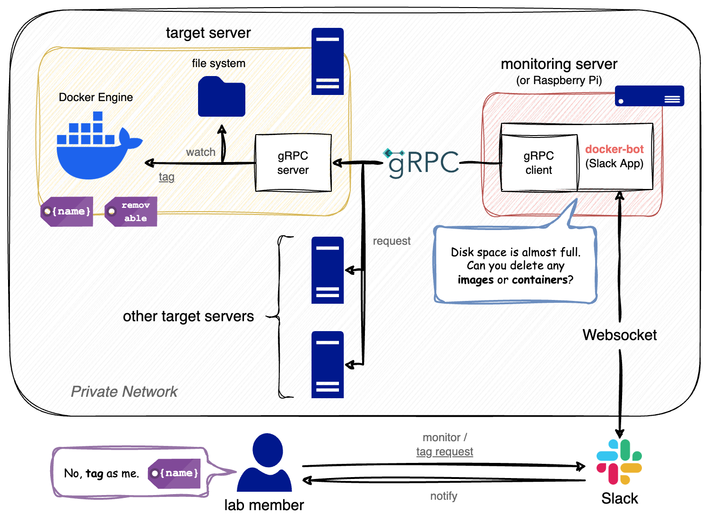

# lab-docker-slackbot
A Slack bot to warn about Docker disk usage and reccomend unused images or containers to remove.



## Usage

```bash
# $ brew install goreleaser
$ make build

# for the target servers
$ scp ./dist/server_linux_amd64_v1/server user@target-server:/path/to/server
$ ssh user@target-server
$ cd /path/to/server
$ chmod +x ./server
$ ./server --port 50051 --path /

# for the monitoring server
$ scp ./dist/client_linux_amd64_v1/client user@monitoring-server:/path/to/client
$ ssh user@monitoring-server
$ cd /path/to/client
$ chmod +x ./client
$ ./client --env .env --config config.yaml
```
